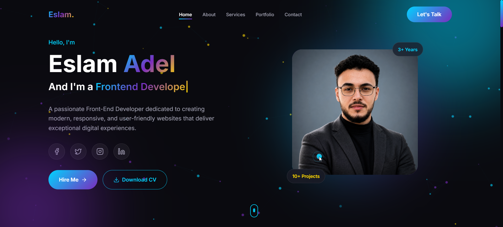
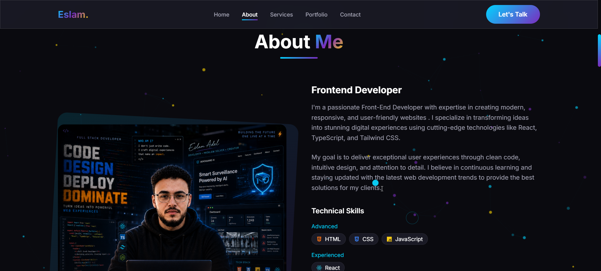
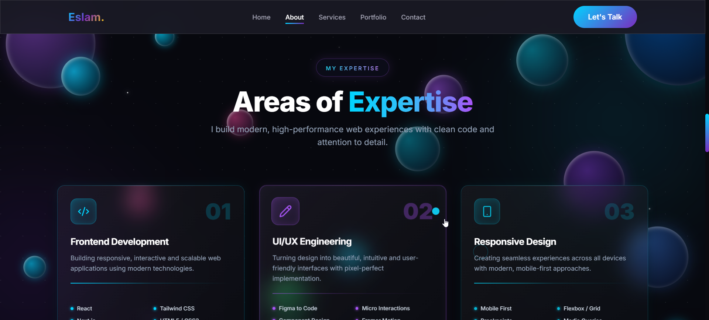

<div align="center">

# 🚀 Eslam Adel | Frontend Developer

### Building Modern, Scalable & High-Performance Web Experiences

<p>
Passionate Frontend Developer focused on crafting responsive, accessible, and visually engaging web applications using modern technologies with clean architecture, optimized performance, and exceptional user experiences.
</p>


<br>

[](https://eslam-adel25.vercel.app/)
[](https://github.com/eslam-adel25)
[]
[

<br>


---

## 🌐 Live Demo

### 🔗 https://eslam-adel25.vercel.app/

---

## 📬 Connect With Me

<a href="mailto:Eslam.Adel2596@gmail.com">

</a>

<a href="https://www.linkedin.com/in/eslam-adel-jadalrab-808862361">

</a>

<a href="https://github.com/eslam-adel25">

</a>

<a href="https://www.facebook.com/eslam20057">

</a>

</div>

---

# ✨ About The Project

This repository contains the complete source code for my personal portfolio website.

More than just a portfolio, this project represents my approach to modern frontend engineering. It demonstrates how clean architecture, reusable components, responsive design, performance optimization, accessibility, and thoughtful UI/UX come together to create a polished production-ready web application.

Built from scratch using the latest frontend technologies, this portfolio showcases not only my projects but also the development principles I apply in real-world applications.

### Core Objectives

- Build a professional online presence.
- Showcase real-world frontend development skills.
- Demonstrate clean architecture and maintainable code.
- Deliver an engaging and responsive user experience.
- Follow modern performance and SEO best practices.
- Maintain production-quality standards across the entire project.

---

# 🚀 Project Highlights

| Feature | Description |
|----------|-------------|
| ⚡ High Performance | Optimized with Vite, TypeScript & Terser |
| 🎨 Modern UI | Glassmorphism, Gradients & Premium Components |
| 📱 Fully Responsive | Desktop, Tablet & Mobile Optimized |
| ✨ Smooth Animations | Powered by Framer Motion |
| 🚀 Production Ready | Deployed on Vercel |
| 🔍 SEO Optimized | Open Graph, Meta Tags & Structured Metadata |
| 🌙 Dark Theme | Elegant futuristic interface |
| ♿ Accessibility | Semantic HTML & Inclusive Design |

---

# 💡 Why This Portfolio?

This portfolio was built with a single philosophy:

> **Creating digital experiences that combine aesthetics, performance, scalability, and maintainable code.**

Every section, animation, interaction, and component was designed with attention to detail to reflect professional frontend development practices.

Instead of relying on templates, this project was developed as a fully customized production-ready application to demonstrate technical expertise, design thinking, and engineering quality.

---

# 🖼 Portfolio Preview

## 🏠 Home



---

## 👨‍💻 About



---

## 💼 Expertise



---

## 📩 Contact


# ✨ Key Features

Designed with modern engineering practices to deliver an exceptional user experience while maintaining clean architecture and production-quality standards.

<table>
<tr>
<td width="50%">

### 🎨 Modern UI/UX

- Premium Glassmorphism Interface
- Smooth Micro-interactions
- Elegant Gradients
- Clean Visual Hierarchy
- Modern Typography
- Professional Layout

</td>

<td width="50%">

### ⚡ Performance

- Optimized Vite Build
- Fast Initial Loading
- Lazy Component Rendering
- Optimized Assets
- Minified Production Bundle
- Smooth Navigation

</td>
</tr>

<tr>
<td>

### 📱 Responsive Design

- Desktop Optimized
- Tablet Friendly
- Mobile Responsive
- Flexible Layouts
- Adaptive Components
- Cross Browser Support

</td>

<td>

### ♿ Accessibility

- Semantic HTML
- Keyboard Friendly
- Proper Contrast
- Responsive Typography
- Accessible Navigation
- User-Centered Experience

</td>
</tr>

<tr>
<td>

### 🔍 SEO Optimization

- Open Graph Metadata
- Twitter Cards
- Canonical URLs
- Search Engine Friendly
- Structured Meta Tags
- Optimized Head Information

</td>

<td>

### 🛠 Developer Experience

- Component-Based Architecture
- Reusable Components
- Type Safety
- Modern Folder Structure
- ESLint Configuration
- Easy Maintenance

</td>
</tr>
</table>

---

# 💼 Featured Projects

## 🚀 StudyMart

A modern educational marketplace platform designed to connect students with high-quality learning resources through an intuitive and responsive interface.

### Highlights

- Responsive Design
- Clean UI
- Modern Component Architecture
- Optimized User Experience
- Interactive Interface

---

## 📘 JavaScript Guide

An educational web application focused on simplifying JavaScript concepts through organized content and an engaging learning experience.

### Highlights

- Beginner Friendly
- Organized Learning Structure
- Responsive Layout
- Clean Navigation
- Interactive Design

---

> More professional projects are currently under development and will be added soon.

---

# 🛠 Technology Stack

This portfolio is built using a carefully selected modern frontend ecosystem focused on scalability, maintainability, performance, and developer experience.

---

## 💻 Frontend

| Technology | Purpose |
|------------|---------|
| React 19 | Component-Based UI |
| TypeScript | Type Safety |
| Vite | Build Tool |
| React DOM | Rendering |

---

## 🎨 Styling

| Technology | Purpose |
|------------|---------|
| Tailwind CSS | Utility-First Styling |
| CSS3 | Custom Styling |
| PostCSS | CSS Processing |
| Tailwind Animate | Advanced Animations |

---

## ✨ Animations

| Technology | Purpose |
|------------|---------|
| Framer Motion | Page & Component Animations |
| CSS Keyframes | Custom Effects |

---

## 🧩 UI Components

| Technology | Purpose |
|------------|---------|
| Radix UI | Accessible Components |
| Lucide React | Modern Icons |
| React Icons | Brand Icons |
| Class Variance Authority | Variant Management |
| clsx | Conditional Classes |
| tailwind-merge | Class Optimization |

---

## 📋 Forms & Validation

| Technology | Purpose |
|------------|---------|
| React Hook Form | Form Management |
| Zod | Schema Validation |
| Hookform Resolvers | Validation Integration |

---

## 📬 Services

| Technology | Purpose |
|------------|---------|
| EmailJS | Contact Form Integration |

---

## 🚀 Deployment

| Technology | Purpose |
|------------|---------|
| Vercel | Hosting Platform |

---

## 🧹 Code Quality

| Technology | Purpose |
|------------|---------|
| ESLint | Code Quality |
| TypeScript ESLint | Static Analysis |
| React Hooks ESLint | Best Practices |

---

## ⚙ Build & Optimization

| Technology | Purpose |
|------------|---------|
| Terser | Production Minification |
| npm | Package Management |

---

# 🏗 Project Architecture

The project follows a scalable component-based architecture where each UI section is isolated into reusable components, making the codebase clean, maintainable, and easy to extend.

```

```text
src/
│
├── assets/
├── components/
├── sections/
├── hooks/
├── lib/
├── styles/
│
├── App.tsx
└── main.tsx
```

### Architecture Principles

- Component Reusability
- Separation of Concerns
- Maintainable Folder Structure
- Type Safety
- Performance First
- Responsive Design
- Clean Code Practices


# 📂 Project Structure

The project follows a scalable and modular architecture to ensure maintainability, readability, and future extensibility.

```text
.
├── public/
│   ├── screenshots/
│   ├── favicon.ico
│   └── ...
│
├── src/
│   ├── assets/
│   ├── components/
│   ├── hooks/
│   ├── lib/
│   ├── sections/
│   ├── App.tsx
│   ├── main.tsx
│   └── index.css
│
├── package.json
├── vite.config.ts
├── tailwind.config.js
├── tsconfig.json
└── README.md
```

---

# ⚙ Getting Started

Follow these instructions to run the project locally.

## 1️⃣ Clone the Repository

```bash
git clone https://github.com/eslam-adel25/<repository-name>.git
```

---

## 2️⃣ Navigate into the Project

```bash
cd <repository-name>
```

---

## 3️⃣ Install Dependencies

```bash
npm install
```

---

## 4️⃣ Start Development Server

```bash
npm run dev
```

The application will be available at:

```text
http://localhost:5173
```

---

# 📜 Available Scripts

| Command | Description |
|---------|-------------|
| npm run dev | Starts the development server |
| npm run build | Builds the application for production |
| npm run preview | Preview the production build locally |
| npm run lint | Run ESLint checks |

---

# 🚀 Production Build

Generate an optimized production build:

```bash
npm run build
```

Preview the production build locally:

```bash
npm run preview
```

---

# 🌍 Deployment

The portfolio is deployed using **Vercel**.

Every push to the production branch automatically triggers:

- Dependency Installation
- Production Build
- Asset Optimization
- Automatic Deployment

### Live Website

🔗 https://eslam-adel25.vercel.app/

---

# 📈 Performance

The project has been optimized with modern frontend performance practices.

### Performance Optimizations

- ⚡ Vite Production Build
- ⚡ Terser Minification
- ⚡ Optimized Assets
- ⚡ Lightweight Components
- ⚡ Smooth Navigation
- ⚡ Fast Initial Load
- ⚡ Optimized CSS Output

---

# 🔍 SEO Optimization

The portfolio includes several SEO best practices.

### Implemented SEO Features

- Open Graph Metadata
- Twitter Cards
- Meta Description
- Keywords
- Canonical URL
- Favicon Package
- Apple Touch Icons
- Social Sharing Preview

---

# 📱 Responsive Design

Designed to provide a consistent experience across all devices.

### Supported Devices

- Desktop
- Laptop
- Tablet
- Mobile

---

# ♿ Accessibility

Accessibility has been considered throughout the project.

### Highlights

- Semantic HTML
- Responsive Typography
- Keyboard Navigation
- Accessible Color Contrast
- Clear Navigation Structure

---

# 🎯 Design Philosophy

This portfolio was designed with a simple principle:

> Build something that reflects how I write production frontend code.

Every component has been developed with attention to:

- Clean Architecture
- Reusable Components
- Modern UI
- Maintainability
- Performance
- Scalability
- User Experience

---

# 📦 Dependencies Overview

Core Technologies

- React 19
- TypeScript
- Vite

UI

- Tailwind CSS
- Radix UI
- Framer Motion
- Lucide React

Forms

- React Hook Form
- Zod

Developer Tools

- ESLint
- PostCSS
- TypeScript ESLint

Deployment

- Vercel

---

# 🔮 Roadmap

Future improvements planned for this portfolio:

- More Professional Projects
- Blog Section
- Case Studies
- Project Filtering
- Dark / Light Theme Toggle
- Multi-language Support
- Performance Dashboard
- Downloadable Resume
- Interactive Project Details

---

# 🤝 Contributing

Although this repository represents my personal portfolio, feedback, suggestions, and constructive discussions are always welcome.

If you have ideas for improvements, feel free to:

- Open an Issue
- Submit a Pull Request
- Contact Me Directly

---

# ⚖ License

This project is proprietary software.

All source code, UI/UX designs, assets, documentation, and other materials are the exclusive intellectual property of **Eslam Adel**.

No permission is granted to use, copy, modify, distribute, reproduce, or create derivative works from this repository without prior written permission from the copyright owner.

See the [LICENSE](LICENSE) file for the complete terms and conditions.

# 📬 Contact

### Eslam Adel

Frontend Developer

📧 Email

Eslam.Adel2596@gmail.com

🌐 Portfolio

https://eslam-adel25.vercel.app/

💼 LinkedIn

https://www.linkedin.com/in/eslam-adel-jadalrab-808862361

🐙 GitHub

https://github.com/eslam-adel25

📘 Facebook

https://www.facebook.com/eslam20057

---

# ⭐ Support

If you found this project useful or inspiring, consider giving it a ⭐ on GitHub.

It helps support my work and motivates me to continue building high-quality open-source projects.

---

<div align="center">

### Thank you for visiting my portfolio.

Made with ❤️ by **Eslam Adel**

© 2026 All Rights Reserved.

</div>